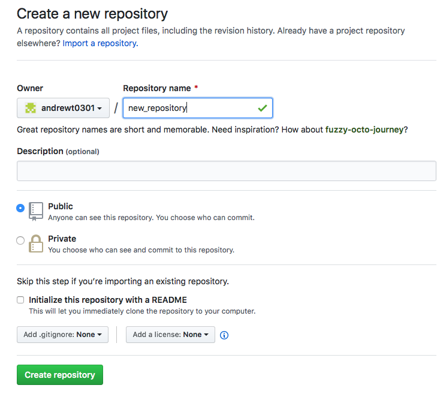
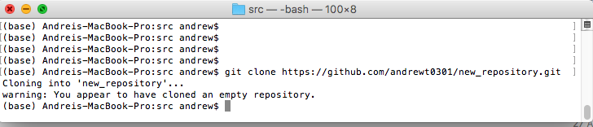

### Tutorial: *How to use GitHub and Git?*

---

[GitHub](http://www.github.com/) is a hosting where you can store source code.
The hosted source code is managed by a version-control system called [Git](https://git-scm.com).

#### Creating an account at GitHub

* Open the link https://github.com
* Click the "Sign up" button.
* In the "Create your account" form, fill the "Username", "Email address" and "Password" fields and
  click button "Next: Select the plan".
* Select a free plan.
* Click the "Complete setup" button.
* You will be sent a verification email. Open it and follow the link it contains.
* Got GitHub and sign in.

#### Creating a GitHub repository

* Sign in into your GitHub account.
* Go to the "Your repositories" tab.
  
* Click the "New" button.
* In the "Create a new repository" form, specify the repository name and click the "Create repository" button.
  
* Now your repository "https://github.com/username/repository" is created.

### Installing Git

To work with GitHub, you need to have the Git version-control system installed
in your computer. To do this, download the installation package from the following page: https://git-scm.com/downloads.
When it is downloaded, run it to install Git.

### Cloning a GitHub repository to a local machine

To start working with a GitHub repository, you need to lone it to your local machine.
To do this, run the following command in the terminal:

    git clone https://github.com/andrewt0301/new_repository.git
    
Now your repository is cloned to your local file system:

### Adding files to a Git repository

* Add place files to the "new_repository" folder in your local file system.
  For example, it can be a file called "my_program.py".
* Now you need to add it to the Git repository.
  To do this, run the following commands:
        
      git add my_program.py
      git commit -m "my_program.py is added"

* Then you need to run the following command to send the changes to GitHub:

      git push origin master    
      
Now your first file is uploaded to GitHub.

### Getting fresh copies from GitHub

When several users commit files to a repository, you need to get a fresh version of the files.
To do this, you need to run the following command:

    pit pull 

### Updating files in a Git repository

To update files, you need to run the same commands as for adding new files:

      git add my_program.py
      git commit -m "my_program.py is updated"
      git push origin maste

### References

The full reference on how to use Git can be found in the Pro Git book - https://git-scm.com/book/en/v2.
